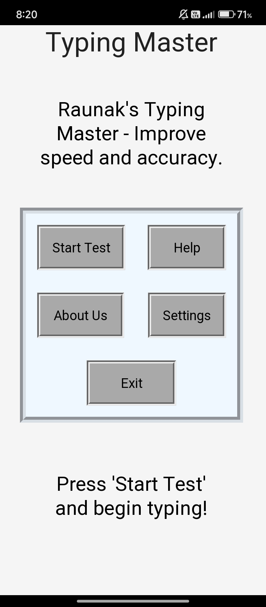

---

# ⌨️ Typing Master

A GUI-based **Typing Speed Tester App** built using **Python** and **Tkinter**. This project is designed to help users improve their typing speed and accuracy in a clean and interactive interface.

---

## 📚 Table of Contents
- [Features](#-features)
- [Screenshot](#-screenshot)
- [Demo](#-demo)
- [Tech Stack](#-tech-stack)
- [How to Run](#-how-to-run)
- [Folder Structure](#-folder-structure)
- [License](#-license)
- [Author](#-author)

---

## 🚀 Features

- Real-time typing speed calculation (Words Per Minute)
- Accuracy tracking
- Countdown timer for sessions
- Clean GUI using Tkinter
- Beginner-friendly and lightweight
- Easy to modify and extend

---

## 🖼️ Screenshot



---

## 🎥 Demo

A short demo of the app in action:  
📹 `demo.mp4` (open in any video player)


---

## ⚙️ Tech Stack

- **Python 3**
- **Tkinter** (Python’s built-in GUI library)

---

## ▶️ How to Run

Make sure Python is installed.

```bash
python typingmaster.py
```

---

## 📂 Folder Structure

typing-master/
├── typingmaster.py
├── README.md
├── LICENSE
├── screenshot.jpg
├── demo.mp4

---

## 📄 License

Licensed under the MIT License.  
See [LICENSE](LICENSE) file for full text.

---

## 🙋‍♂️ Author

**Raunak Raj**  
- Class 10 Student | From India 🇮🇳  
- Aspiring Freelancer | Web Developer | Python Programmer  
- [Portfolio Website](https://raunak-raj-2025.github.io)
